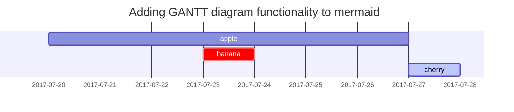

## 📖Markdown이 무엇인지 알아봅시다!
>_**마크다운(Markdown)** 은 일반 텍스트 기반의 경량 마크업 언어다. 일반 텍스트로 서식이 있는 문서를 작성하는 데 사용되며, 일반 마크업 언어에 비해 문법이 쉽고 간단한 것이 특징이다. HTML과 리치 텍스트(RTF) 등 서식 문서로 쉽게 변환되기 때문에 응용 소프트웨어와 함께 배포되는 README 파일이나 온라인 게시물 등에 많이 사용된다_
>
><cite>출처: <https://ko.wikipedia.org/wiki/%EB%A7%88%ED%81%AC%EB%8B%A4%EC%9A%B4></cite>

>_**What is Markdown?**
<br/>Markdown is a lightweight markup language that you can use to add formatting elements to plaintext text documents. Created by John Gruber in 2004, Markdown is now one of the world’s most popular markup languages._
>
>_Using Markdown is different than using a WYSIWYG editor. In an application like Microsoft Word, you click buttons to format words and phrases, and the changes are visible immediately. Markdown isn’t like that. When you create a Markdown-formatted file, you add Markdown syntax to the text to indicate which words and phrases should look different._
>
><cite>출처: <https://www.markdownguide.org/getting-started/></cite>

**Markdown**은 언어는 2004년에 *존 그루버*와 *에런 스워츠*를 통해 만들어진 경량화된 마크업 언어입니다.

md 혹은 .markdown의 확장자로 저장이 되는 파일들은 Markdown 구문을 사용하게 되는데, GitHub에서 Repository를 새롭게 생성할 때 만들어지는 **README.md** 파일이 대표적이라고 할 수 있겠네요.

또한, 현재 블로그에 작성되는 포스트들도 전부 Markdown형식의 문서들입니다.

앞으로 블로그를 관리하기 위해 Markdown에 대해 간략하게 알아보려고 포스팅을 하게 됐습니다.

---

## 💪Markdown을 써야하는 이유는?
여러가지 이유가 존재하지만, [markdownguide](https://www.markdownguide.org/)의 말을 빌려보자면...

- 웹사이트, 문서, 노트, 책, 프레젠테이션, 이메일 메세지 등 **어디에든** 사용 가능
- 높은 **이식성**
- 플랫폼에 **독립적**
- **간결**하고 별도의 도구 없이도 작성 가능

등과 같은 여러가지 장점을 보유하고 있다고 합니다.

확실히 텍스트 문서에 Markdown 문법만 적용하면 어디서든 사용이 가능하기 때문에 사용하기 쉽고 어느 곳이든 적용하기 쉽다는 장점이 있는 것 같아요.

그러나, 명확한 표준이 없기 때문에 사용하는 곳에 따라서 Markdown 문법이 조금 다를 수도 있고, 모든 HTML 마크업을 대체할 수는 없다는 것이 한계라고 볼 수 있겠네요.

---

## 🔥여러가지 Markdown 문법들

저의 블로그는 Jekyll이라는 정적 사이트 생성기를 통해 만들어졌습니다! Jekyll로 만들어진 수 많은 theme 중에서 Chirpy 테마를 적용했습니다.

아래로는 Chirpy theme의 showcase에서 확인할 수 있는 여러가지 Markdown 문법들을 정리해보겠습니다.

---

### Headings

# H1 - heading
{: .mt-4 .mb-0 }

## H2 - heading
{: data-toc-skip='' .mt-4 .mb-0 }

### H3 - heading
{: data-toc-skip='' .mt-4 .mb-0 }

#### H4 - heading
{: data-toc-skip='' .mt-4 }

##### H5 -heading

###### H6 -heading 

헤더를 만들기 위해 `#` 다음에 제목을 작성합니다! 

prefix의 갯수에 따라 heading의 종류가 달라졌네요.

>**heading의 구분**
>
>- h1: # 부(parts)에 사용됨.
>- h2: ## 장(chapters)에 사용됨.
>- h3: ###, 페이지 섹션에 사용함.
>- h4: ####, 하위 섹션에 사용됨.
>- h5: #####, 하위 섹션 아래의 하위 섹션에 사용됨.
>- h6: ######, 문단에 (h6와 p의 크기는 같다) 
>
> <cite>출처: <https://anys4udoc.readthedocs.io/en/latest/attach/doc-markdown.html></cite>

---

### Paragraph
Lorem ipsum dolor sit amet, consectetuer adipiscing elit. Aenean commodo ligula eget dolor. Aenean massa. Cum sociis natoque penatibus et magnis dis parturient montes, nascetur ridiculus mus. Donec quam felis, ultricies nec, pellentesque eu, pretium quis, sem.

Nulla consequat massa quis enim. Donec pede justo, fringilla vel, aliquet nec, vulputate eget, arcu. In enim justo, rhoncus ut, imperdiet a, venenatis vitae, justo. Nullam dictum felis eu pede mollis pretium. Integer tincidunt. Cras dapibus. Vivamus elementum semper nisi. Aenean vulputate eleifend tellus. Aenean leo ligula, porttitor eu, consequat vitae, eleifend ac, enim. Aliquam lorem ante, dapibus in, viverra quis, feugiat a,

문단의 경우 별다른 문법 없네요.

---

### Horizontal Rules
---
***
----
*****

`-`이나 `*`을 3개 이상 연달아 이어주면 됩니다!

---

### Lists

#### Ordered list
1. Firstly
2. Secondly
3. Thirdly

#### Unordered list
- Chapter
  - Section
    - Paragraph

- dog
- cat
- bird

#### ToDo list
- [ ] Job
  - [x] Step 1
  - [x] Step 2
  - [ ] Step 3

#### Description list

Sun
: the star around which the earth orbits

Moon
: the natural satellite of the earth, visible by reflected light from the sun

<br/>

정렬 리스트의 경우 보이는 그대로 `1. 2. 3.`를 사용하면 되고, 

비정렬 리스트의 경우 `-`을

ToDo 리스트의 경우 `-[ ]`와 `-[x]`를 사용해줍니다. 

Description list의 경우 설명이 필요한 단어 아래에 `:`을 사용해줬습니다.

---

### Block Quote

> This line shows the _block quote_.

블록 인용구의 경우 `>`를 사용했습니다.

---

### Prompts

<!-- markdownlint-capture -->
<!-- markdownlint-disable -->
> An example showing the `tip` type prompt.
{: .prompt-tip }

> An example showing the `info` type prompt.
{: .prompt-info }

> An example showing the `warning` type prompt.
{: .prompt-warning }

> An example showing the `danger` type prompt.
{: .prompt-danger }
<!-- markdownlint-restore -->

Prompt의 경우 블록 인용구처럼 `>`를 사용하는 것까지는 동일하지만
- `{: .prompt-tip }` 
- `{: .prompt-info }` 
- `{: .prompt-warning }`
- `{: .prompt-danger }`

위 구문들을 Prompt를 적용할 문장 아래에 추가해주었습니다.

---

### Tables

| Company                      | Contact          | Country |
| :--------------------------- | :--------------- | ------: |
| Alfreds Futterkiste          | Maria Anders     | Germany |
| Island Trading               | Helen Bennett    |      UK |
| Magazzini Alimentari Riuniti | Giovanni Rovelli |   Italy |

테이블의 경우 각각의 열을 `|`로 구분해주었고, 행은 개행문자를 통해 자동으로 구분되지만 머리글 행의 경우 첫 행 아래에 

`| :--------------------------- | :--------------- | ------: |`

와 같이 구문을 작성하여 다른 행과 구분을 지어주었습니다.

``` 
| Company                      | Contact          | Country |
| :--------------------------- | :--------------- | ------: |
| Alfreds Futterkiste          | Maria Anders     | Germany |
| Island Trading               | Helen Bennett    |      UK |
| Magazzini Alimentari Riuniti | Giovanni Rovelli |   Italy |
```

---

### Links

<http://127.0.0.1:4000>

Link의 경우 `<>` 내부에 url을 작성합니다. 


>만약 url 그 자체가 아니라, 텍스트에 따로 Link를 주고 싶은 경우에는
>[markdownguide](https://www.markdownguide.org/)
>`[markdownguide](https://www.markdownguide.org/)`
>처럼 사용할 수 있습니다.
{: .prompt-tip }

---

### Footnote

Click the hook will locate the footnote[^footnote], and here is another footnote[^fn-nth-2].

```
Click the hook will locate the footnote[^footnote], and here is another footnote[^fn-nth-2].
```

각주의 문법은 위와 같습니다.

---

### Inline code

This is an example of `Inline Code`.

Inline code의 경우 backtick( ` )으로 감싸주면 됩니다!

---

### Filepath

Here is the `/path/to/the/file.extend`{: .filepath}.
```
`/path/to/the/file.extend`{: .filepath}
```
Inline code 아래에 {: .filepath} 구문을 사용했습니다.

---

### Code blocks

#### Common

```text
This is a common code snippet, without syntax highlight and line number.
```

#### Specific Language

```bash
if [ $? -ne 0 ]; then
  echo "The command was not successful.";
  #do the needful / exit
fi;
```

#### Specific filename

```sass
@import
  "colors/light-typography",
  "colors/dark-typography";
```
{: file='_sass/jekyll-theme-chirpy.scss'}

Code block의 경우 back tick을 연달아 세 개를 사용합니다!


>첫 back tick 행의 마지막에 language를 작성해 syntax color를 적용할 수 있습니다!
>
>(e.g. javascript, css, python, java, json, sql, ...)
{: .prompt-tip }

---

### Mathematics
> 내용 추가가 필요함!
{: .prompt-warning }

The mathematics powered by [**MathJax**](https://www.mathjax.org/):

$$
\begin{equation}
  \sum_{n=1}^\infty 1/n^2 = \frac{\pi^2}{6}
  \label{eq:series}
\end{equation}
$$

We can reference the equation as \eqref{eq:series}.

When $a \ne 0$, there are two solutions to $ax^2 + bx + c = 0$ and they are

$$ x = {-b \pm \sqrt{b^2-4ac} \over 2a} $$

```
$$
\begin{equation}
  \sum_{n=1}^\infty 1/n^2 = \frac{\pi^2}{6}
  \label{eq:series}
\end{equation}
$$

We can reference the equation as \eqref{eq:series}.

When $a \ne 0$, there are two solutions to $ax^2 + bx + c = 0$ and they are

$$ x = {-b \pm \sqrt{b^2-4ac} \over 2a} $$
```

---

### Mermaid SVG
> 내용 추가가 필요함!
{: .prompt-warning }



---

### Images
> 내용 추가가 필요함!
{: .prompt-warning }

#### Default (with caption)

{: width="972" height="589" }
_Full screen width and center alignment_

```
{: width="972" height="589" }
_Full screen width and center alignment_

```

#### Left aligned

{: width="972" height="589" .w-75 .normal}

```
{: width="972" height="589" .w-75 .normal}
```

#### Float to left

{: width="972" height="589" .w-50 .left}
Praesent maximus aliquam sapien. Sed vel neque in dolor pulvinar auctor. Maecenas pharetra, sem sit amet interdum posuere, tellus lacus eleifend magna, ac lobortis felis ipsum id sapien. Proin ornare rutrum metus, ac convallis diam volutpat sit amet. Phasellus volutpat, elit sit amet tincidunt mollis, felis mi scelerisque mauris, ut facilisis leo magna accumsan sapien. In rutrum vehicula nisl eget tempor. Nullam maximus ullamcorper libero non maximus. Integer ultricies velit id convallis varius. Praesent eu nisl eu urna finibus ultrices id nec ex. Mauris ac mattis quam. Fusce aliquam est nec sapien bibendum, vitae malesuada ligula condimentum.

```
{: width="972" height="589" .w-50 .left}
```

#### Float to right

{: width="972" height="589" .w-50 .right}
Praesent maximus aliquam sapien. Sed vel neque in dolor pulvinar auctor. Maecenas pharetra, sem sit amet interdum posuere, tellus lacus eleifend magna, ac lobortis felis ipsum id sapien. Proin ornare rutrum metus, ac convallis diam volutpat sit amet. Phasellus volutpat, elit sit amet tincidunt mollis, felis mi scelerisque mauris, ut facilisis leo magna accumsan sapien. In rutrum vehicula nisl eget tempor. Nullam maximus ullamcorper libero non maximus. Integer ultricies velit id convallis varius. Praesent eu nisl eu urna finibus ultrices id nec ex. Mauris ac mattis quam. Fusce aliquam est nec sapien bibendum, vitae malesuada ligula condimentum.

```
{: width="972" height="589" .w-50 .right}
```

#### Dark/Light mode & Shadow

The image below will toggle dark/light mode based on theme preference, notice it has shadows.

{: .light .w-75 .shadow .rounded-10 w='1212' h='668' }
{: .dark .w-75 .shadow .rounded-10 w='1212' h='668' }

```
The image below will toggle dark/light mode based on theme preference, notice it has shadows.

{: .light .w-75 .shadow .rounded-10 w='1212' h='668' }
{: .dark .w-75 .shadow .rounded-10 w='1212' h='668' }
```

---

### Video
> 내용 추가가 필요함!
{: .prompt-warning }



```

```

---

### Reverse Footnote

[^footnote]: The footnote source
[^fn-nth-2]: The 2nd footnote source

```
[^footnote]: The footnote source
[^fn-nth-2]: The 2nd footnote source

포스트 맨 아래에서 확인할 수 있어요!
```

---

## 🤓Markdown 파일을 쉽게 작성하는 방법

주로 대중화된 방법으로는 **Markdown editor**를 사용하는 방법입니다.

[easyme.md](https://www.easy-me.com/d)와 같은 에디터를 사용하면 쉽게 md파일을 작성할 수 있지만, 위에서 설명한 것처럼

표준이 없기 때문에 구문이 조금씩 다를 수는 있어요. (현재 사이트에 작성된 구문 또한 위 에디터에서 제공해주는 문법과 약간은 상이합니다.) 

## 📕끝으로...

크게 어렵지 않은 문법들이지만, 사용하면서 익숙해지고 잊을만 하면 확인해야할 것 같아서

블로그에 미리 기록해둡니다!

알아보면서 개인적으로 궁금했던 것은 `{: }` 를 사용한 구문도 있던데 여기에 대해서도 한 번 다음에 조사해봐야겠어요.

추가!! `{: .prompt-warning }` 과 같은 표현은

 **CSS를 지정하는 것** 이라고 하네요.

 `.`이 css에서 클래스 선택자이고, 이 외에도 `{: width="568" }` 과 같이 사용하면 css 속성에 값을 적용하는 식으로요!

---